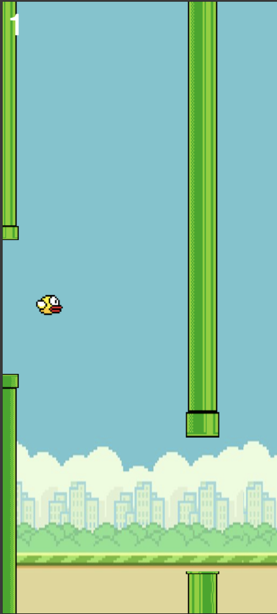

# Flappy Bird Clone 🐦

**A Classic Arcade-Style Game Built with HTML5 Canvas & Vanilla JavaScript**

[](LICENSE)
[](https://github.com/Antonious-Awad/flappy-bird/actions)

A modern implementation of the classic Flappy Bird game featuring responsive design, smooth animations, and authentic gameplay mechanics. Perfect for web gaming enthusiasts and developers looking to learn canvas game development!

**Live Demo:** <a target="_blank" href="https://antonious-awad.github.io/flappy-bird/">Play Now</a>

<p align="center">


---

## 🎮 Features

- **Authentic Gameplay Physics**  
  Precise gravity simulation and collision detection
- **Responsive Design**  
  Works flawlessly on desktop and mobile devices
- **Dynamic Background System**  
  Auto-adjusting parallax scrolling pattern
- **Game State Management**  
  Smooth transitions between menu/game/over screens
- **Score Tracking**  
  Persistent high score system
- **Touch & Keyboard Support**  
  Play with spacebar, mouse click, or touch input

---

## 💻 Technologies

- **Core Engine**  
  
  
  

- **Key Features**
  - Vanilla JavaScript (No frameworks!)
  - CSS3
  - Mobile-First Design

---

## 🕹️ How to Play

**Objective:** Navigate through pipes without touching them!  
**Controls:**

- `SPACE`/`CLICK`/`TOUCH` - Jump

**Scoring:**

- +1 point for each pipe pair cleared
- Best score persists between sessions

---

## 🛠️ Installation

1.  Clone repository:

    ```bash
    git clone https://github.com/yourusername/flappy-bird.git
    ```

2.  Serve it using a live server (or use any live server option of your choice):

    ```bash
    cd flappy-bird && python3 -m http.server <your desired port>
    ```

---

## 🚀 Deployment

Deploy your own version with one click:

[](https://app.netlify.com/start/deploy?repository=https://github.com/Antonious-Awad/flappy-bird)

**Manual Deployment Options:**

- [Github Pages](https://pages.github.com/)
- [Vercel](https://vercel.com/)
- [Netlify](https://www.netlify.com/)
- Traditional web hosting

---

# 🎨 Customization

Easily modify game parameters in `src/constants.js`:

```js
export const GAME_SETTINGS = {
  GRAVITY: 0.5,
  FLAP_FORCE: -6,
  PIPE_GAP: 200,
  PIPE_INTERVAL: 2500,
  // ... other settings
};
```

---

# 📜 License

This project is licensed under the MIT License - see the [LICENSE](LICENSE) file for details.

Disclaimer: This project is for educational purposes only. All game assets are original creations or used under appropriate licenses.

Happy Flapping! 🚀
